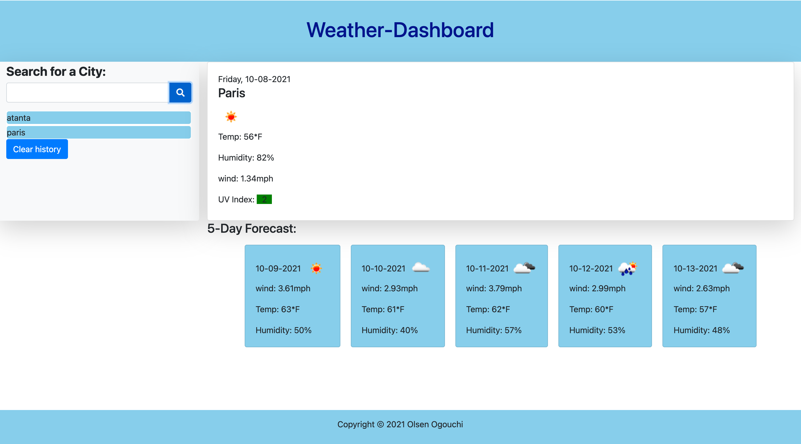

# Weather-Dashboard

## Description

A Weather Dashbord application that allow users to search the weather condition in multiple cities.
It runs in the browser search for an API and feature dynamically updated HTML and CSS powered by jQuery.
## Mock-Up

## Links
* URL of the deployed application
https://chrisolsen1993.github.io/Weather-Dashboard/

* URL of github repository
https://github.com/Chrisolsen1993?tab=repositories

##Contributor
© 2021 Olsen Ogouchi All Rights Reserved.